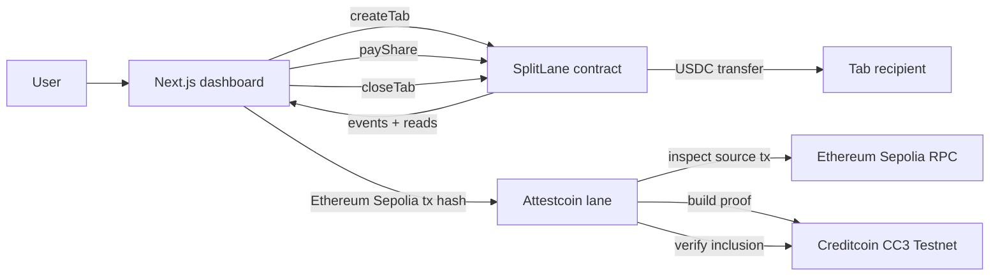

# SplitLane architecture

SplitLane has three parts:

1. A Solidity contract that stores tabs and settles USDC directly to the recipient.
2. A Next.js dashboard that can run in demo mode or against live contracts.
3. An Attestcoin lane that proves Ethereum Sepolia receipt transactions on Creditcoin CC3 Testnet.

## System flow

## Contract layer

`contracts/src/SplitLane.sol` implements the core settlement logic.

- `createTab(...)` records the recipient, title, metadata hash, participants, and fixed share amounts.
- `payShare(tabId)` transfers the caller's share directly to the recipient with `SafeERC20`.
- `closeTab(tabId)` stops any remaining unpaid shares from settling and records the unpaid amount.

Key properties:

- USDC address is immutable after deployment.
- Native currency is rejected.
- Reentrancy is guarded.
- The contract stores no admin controls, withdrawal controls, or upgrade hooks.
- A recipient cannot assign a share to the same recipient address.

## Web layer

`apps/web/` is a Next.js 16 dashboard.

- It can show live tabs when a contract address is configured.
- It falls back to deterministic demo data when live addresses are absent.
- It supports Base Sepolia and Ethereum Sepolia.
- It sends exact USDC approvals before settlement when the live path needs them.
- It shows transaction state and links to the correct explorer per chain.
- It stores the selected chain and tab ID in the URL and loads a requested older tab directly.

Important detail:

- Base Sepolia can be used for the SplitLane app and contract.
- Base Sepolia is not accepted by the Attestcoin lane.

## Attestcoin layer

`packages/attestcoin/` is a fail-closed proof lane.

- It only accepts Ethereum Sepolia as the source chain.
- It verifies the transaction destination against the configured SplitLane address.
- It only accepts explicit function signatures, with `payShare(uint256)` as the default.
- It uses CC3 ChainInfo discovery to resolve the Ethereum Sepolia chain key.
- Dry-run mode builds and verifies the proof without submitting a CC3 transaction.
- Verify mode additionally submits a CC3 verification transaction with an injected signer.

## Trust boundaries

| Boundary | Trusted assumption |
| --- | --- |
| User wallet | The wallet owner approves the transaction being signed |
| SplitLane contract | The contract only handles USDC and never holds a pool balance after settlement |
| Frontend state | Demo mode is convenience only and must not be treated as proof of settlement |
| Attestcoin lane | Ethereum Sepolia only; Base Sepolia is intentionally rejected |
| CC3 Testnet | Used only for proof verification and attestation |

## Delivery status

The repository currently contains source, tests, and docs only.

- No mainnet deployment is claimed.
- No testnet deployment address is hard-coded in this document.
- No DoraHacks submission has been made from this workspace.
